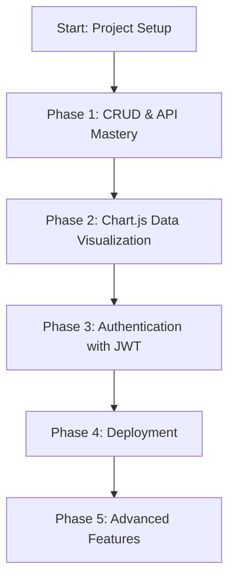

# 💸 Moolah Check — MERN Stack Expense Tracker

Master the MERN stack step by step by building a full-featured expense tracker with authentication, data visualization, and real-world deployment.

---

## 🧭 Learning Roadmap (Graphic)


---

## ✅ Phase 1: CRUD Mastery & API Design
🔧 Goal: Understand core backend/frontend interaction

### 👨‍💻 Backend
- Create an Expense model using Mongoose (title, amount, category, date, etc.)
- Build CRUD routes:
    - POST /api/expenses: Add expense
    - GET /api/expenses: List all
    - PUT /api/expenses/:id: Update
    - DELETE /api/expenses/:id: Remove
- Test routes using Postman or Thunder Client

### 🌐 Frontend
 Create a simple form to add an expense

 List expenses in a table or list

 Add edit and delete buttons

 Use Axios or Fetch to call your API

✅ Once this is done, you’ll deeply understand how data flows from client → server → DB → client.

## 📊 Phase 2: Data Visualization with Chart.js
🎯 Goal: Learn how to transform and present backend data on the frontend

 Install: npm install chart.js react-chartjs-2

 Create graphs:

Bar chart: Monthly totals

Doughnut chart: Expenses by category

 Backend:

Add aggregation route(s) if needed (e.g. /api/stats/monthly)

 Frontend:

Fetch data

Format for Chart.js

Display graphs

## 🔐 Phase 3: Authentication (JWT-based)
🔒 Goal: Learn how to implement secure user login and route protection

### Backend
 Add User model with email + hashed password (bcryptjs)

 Create routes:

POST /api/register

POST /api/login → return JWT

 Add middleware to protect expense routes (verifyToken using jsonwebtoken)

### Frontend
 Create login and register forms

 Store JWT token in localStorage or httpOnly cookies

 Attach JWT in Axios headers

 Redirect or protect pages based on login state

## 🌍 Phase 4: Deployment
🚀 Goal: Learn how to ship a fullstack MERN app

 Use Vercel for the React frontend

 Use Render, Railway, or Fly.io for the Node.js backend

 Connect your Docker MongoDB to a cloud MongoDB Atlas instance

 Use .env.production for production secrets

## ⚙️ Phase 5: Advanced Concepts
🧠 Optional deeper learning paths:

🔁 Pagination (limit and skip in MongoDB)

🔍 Filtering & Search (by category, date range)

🧹 Error handling middleware and custom error classes

📦 Modularize backend (controllers/, routes/, models/)

⏱️ Rate limiting or simple analytics

🧪 Testing: Jest and Supertest for backend APIs

## 🗃️ Optional Bonus: Admin Dashboard or Multi-User Support
Add user roles (e.g., admin vs normal user)

Each user sees only their expenses

Add categories/tags management

## 📁 Project Structure

```text
moolah-check/
├── client/            # React frontend
│   ├── src/
│   │   ├── components/
│   │   ├── pages/
│   │   ├── charts/    # Chart.js components
│   │   ├── context/
│   │   ├── App.js
│   │   └── index.js
│   └── package.json
├── server/            # Express backend
│   ├── controllers/
│   ├── models/
│   ├── routes/
│   ├── middleware/
│   ├── config/
│   ├── server.js
│   ├── .env
│   └── package.json
├── .gitignore
└── README.md
