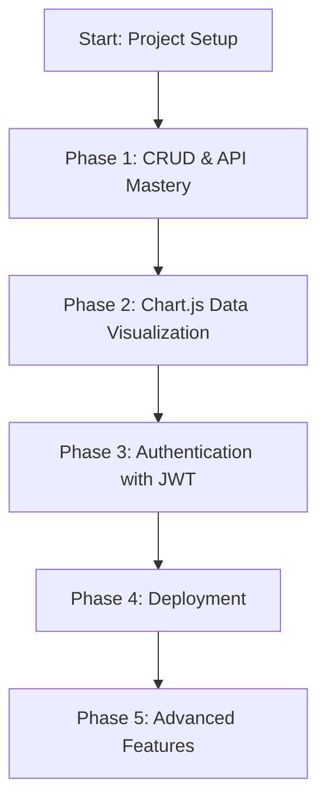

# 💸 Moolah Check — MERN Stack Expense Tracker

Master the MERN stack step by step by building a full-featured expense tracker with authentication, data visualization, and real-world deployment.

---

## 🧭 Learning Roadmap (Graphic)


File structure:
moolah-check/
├── client/            # React frontend
│   ├── src/
│   │   ├── components/
│   │   ├── pages/
│   │   ├── charts/    # Chart.js components
│   │   ├── context/
│   │   ├── App.js
│   │   └── index.js
│   └── package.json
├── server/            # Express backend
│   ├── controllers/
│   ├── models/
│   ├── routes/
│   ├── middleware/
│   ├── config/
│   ├── server.js
│   ├── .env
│   └── package.json
├── .gitignore
└── README.
```